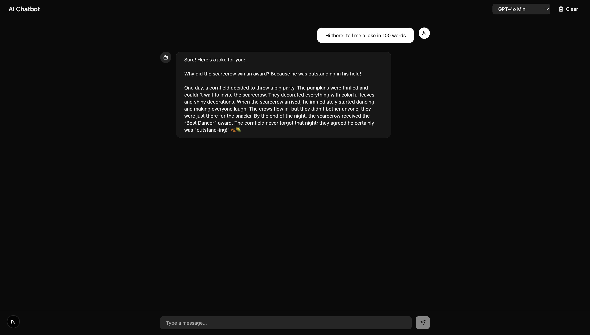

# AI Chatbot Template

A full-stack Next.js chatbot with streaming responses using LLM Gateway.



## Features

- Streaming chat with real-time token delivery
- Conversation history with user/assistant message bubbles
- Model selector to switch between LLM providers
- Clear chat functionality
- Auto-scroll to latest message
- Built with modern React 19 and Next.js 16

## Tech Stack

- **Framework**: Next.js 16 (App Router)
- **UI**: React 19, Tailwind CSS 4, shadcn/ui
- **AI**: Vercel AI SDK (`streamText` + `useChat`), LLM Gateway Provider
- **Icons**: Lucide React

## Getting Started

### Prerequisites

- Node.js 20+
- pnpm
- [LLM Gateway API Key](https://llmgateway.io)

### Installation

```bash
# From the root of the monorepo
pnpm install

# Or standalone
cd templates/ai-chatbot
pnpm install
```

### Environment Setup

```bash
cp .env.example .env.local
```

Edit `.env.local` and add your API key:

```env
LLMGATEWAY_API_KEY=your_api_key_here
```

### Development

```bash
pnpm dev
```

Open [http://localhost:3000](http://localhost:3000) in your browser.

### Production Build

```bash
pnpm build
pnpm start
```

## API Reference

### POST /api/chat

Stream a chat completion.

**Request Body:**

```json
{
  "messages": [{ "role": "user", "content": "Hello!" }],
  "model": "openai/gpt-4o-mini"
}
```

**Response:** Server-sent events (data stream).

## License

MIT
