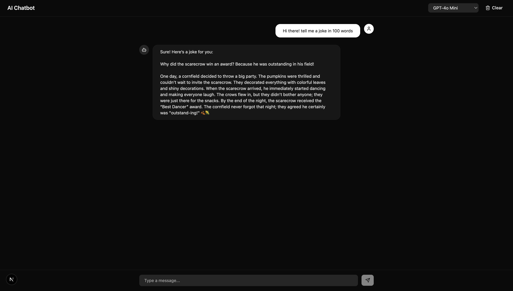

# AI Chatbot Template

A full-stack Next.js chatbot with streaming responses using LLM Gateway.



[Live Demo](https://llm-ai-chatbot-brown.vercel.app)

[](https://vercel.com/new/clone?repository-url=https%3A%2F%2Fgithub.com%2Ftheopenco%2Fllmgateway-templates&env=LLMGATEWAY_API_KEY&envDescription=Get%20your%20API%20key%20from%20llmgateway.io&envLink=https%3A%2F%2Fllmgateway.io&project-name=llm-ai-chatbot&repository-name=llm-ai-chatbot&root-directory=templates/ai-chatbot)

## Features

- Streaming chat with real-time token delivery
- Conversation history with user/assistant message bubbles
- Searchable model picker ([AI Elements model selector](https://elements.ai-sdk.dev/components/model-selector)) filled live from the LLM Gateway catalog
- Clear chat functionality
- Auto-scroll to latest message
- Built with modern React 19 and Next.js 16

## Tech Stack

- **Framework**: Next.js 16 (App Router)
- **UI**: React 19, Tailwind CSS 4, shadcn/ui
- **AI**: Vercel AI SDK (`streamText` + `useChat`), LLM Gateway Provider
- **Icons**: Lucide React

## Getting Started

### Prerequisites

- Node.js 20+
- pnpm
- [LLM Gateway API Key](https://llmgateway.io)

### Installation

```bash
# From the root of the monorepo
pnpm install

# Or standalone
cd templates/ai-chatbot
pnpm install
```

### Environment Setup

```bash
cp .env.example .env.local
```

Edit `.env.local` and add your API key:

```env
LLMGATEWAY_API_KEY=your_api_key_here
```

### Development

```bash
pnpm dev
```

Open [http://localhost:3000](http://localhost:3000) in your browser.

### Production Build

```bash
pnpm build
pnpm start
```

## API Reference

### POST /api/chat

Stream a chat completion.

**Request Body:**

```json
{
  "messages": [{ "role": "user", "content": "Hello!" }],
  "model": "gpt-5.4-mini"
}
```

**Response:** Server-sent events (data stream).

## Model catalog

The picker is filled at request time from the gateway's public [`/v1/models`](https://api.llmgateway.io/v1/models) catalog (`src/lib/models.ts`, revalidated hourly), so models added to LLM Gateway show up without a code change. Model ids are sent unprefixed (`gpt-5.4-mini`) so the gateway [smart-routes](https://docs.llmgateway.io/features/routing) each request to the best available provider — prefix one with a provider id (`openai/gpt-5.4-mini`) to pin it instead.

## License

MIT
