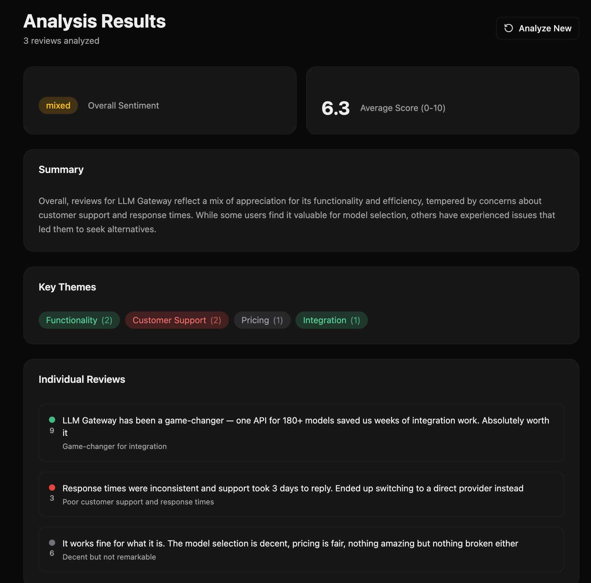

# Feedback Dashboard Template

A full-stack Next.js app for AI-powered customer feedback sentiment analysis using LLM Gateway.



[Live Demo](https://llm-feedback-dashboard.vercel.app)

[](https://vercel.com/new/clone?repository-url=https%3A%2F%2Fgithub.com%2Ftheopenco%2Fllmgateway-templates&env=LLMGATEWAY_API_KEY&envDescription=Get%20your%20API%20key%20from%20llmgateway.io&envLink=https%3A%2F%2Fllmgateway.io&project-name=llm-feedback-dashboard&repository-name=llm-feedback-dashboard&root-directory=templates/feedback-dashboard)

## Features

- Paste customer reviews (one per line) for analysis
- AI-powered sentiment analysis with structured output
- Overall sentiment badge and average score
- Key themes extraction with sentiment indicators
- Individual review analysis with scores and key phrases
- Sample data to try it instantly
- Built with modern React 19 and Next.js 16

## Tech Stack

- **Framework**: Next.js 16 (App Router)
- **UI**: React 19, Tailwind CSS 4, shadcn/ui
- **AI**: Vercel AI SDK (`generateObject`), LLM Gateway Provider
- **Icons**: Lucide React

## Getting Started

### Prerequisites

- Node.js 20+
- pnpm
- [LLM Gateway API Key](https://llmgateway.io)

### Installation

```bash
# From the root of the monorepo
pnpm install

# Or standalone
cd templates/feedback-dashboard
pnpm install
```

### Environment Setup

```bash
cp .env.example .env.local
```

Edit `.env.local` and add your API key:

```env
LLMGATEWAY_API_KEY=your_api_key_here
```

### Development

```bash
pnpm dev
```

Open [http://localhost:3000](http://localhost:3000) in your browser.

### Production Build

```bash
pnpm build
pnpm start
```

## API Reference

### POST /api/analyze

Analyze customer reviews for sentiment.

**Request Body:**

```json
{
  "reviews": "Great product!\nTerrible support.\nPretty average."
}
```

**Response:**

```json
{
  "overallSentiment": "mixed",
  "averageScore": 5.5,
  "summary": "...",
  "themes": [{ "name": "Support", "count": 1, "sentiment": "negative" }],
  "reviews": [
    {
      "text": "Great product!",
      "sentiment": "positive",
      "score": 9,
      "keyPhrase": "Great product"
    }
  ]
}
```

## License

MIT
