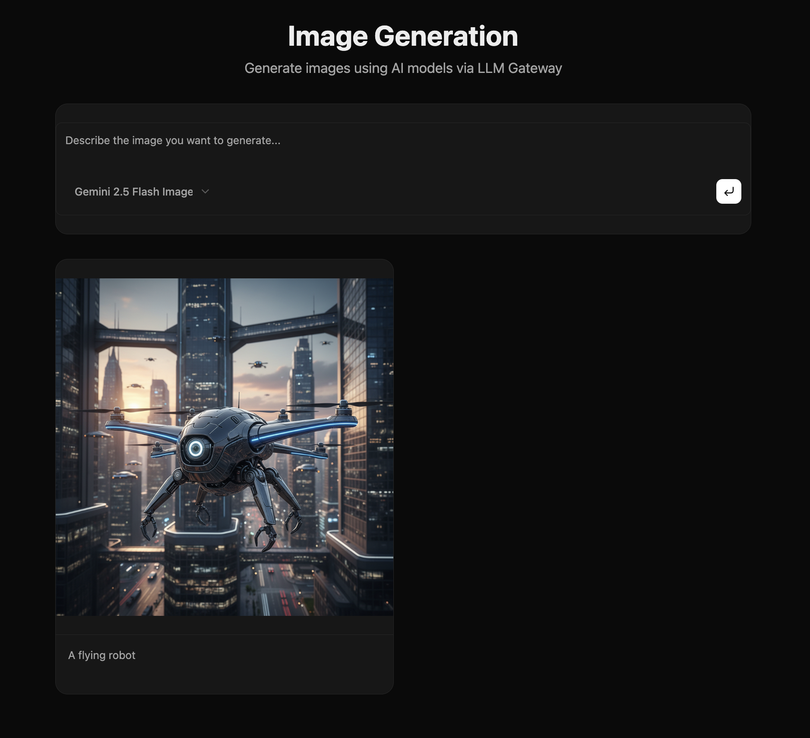

# Image Generation Template

A full-stack Next.js application for generating images using AI models through LLM Gateway.



[](https://vercel.com/new/clone?repository-url=https%3A%2F%2Fgithub.com%2Ftheopenco%2Fllmgateway-templates&env=LLMGATEWAY_API_KEY&envDescription=Get%20your%20API%20key%20from%20llmgateway.io&envLink=https%3A%2F%2Fllmgateway.io&project-name=llm-image-generation&repository-name=llm-image-generation&root-directory=templates/image-generation)

[](https://railway.com/template/llm-image-generation?referralCode=llmgateway)

## Features

- Dynamic model selection from available LLM Gateway image models
- Real-time image generation with loading states
- Responsive grid display of generated images
- Built with modern React 19 and Next.js 16
- Beautiful UI with shadcn/ui components

## Tech Stack

- **Framework**: Next.js 16 (App Router)
- **UI**: React 19, Tailwind CSS 4, shadcn/ui
- **AI**: Vercel AI SDK, LLM Gateway Provider
- **Icons**: Lucide React

## Getting Started

### Prerequisites

- Node.js 20+
- pnpm
- [LLM Gateway API Key](https://llmgateway.io)

### Installation

```bash
# From the root of the monorepo
pnpm install

# Or standalone
cd templates/image-generation
pnpm install
```

### Environment Setup

```bash
cp .env.example .env.local
```

Edit `.env.local` and add your API key:

```env
LLMGATEWAY_API_KEY=your_api_key_here
```

### Development

```bash
pnpm dev
```

Open [http://localhost:3000](http://localhost:3000) in your browser.

### Production Build

```bash
pnpm build
pnpm start
```

## Project Structure

```
image-generation/
├── src/
│   ├── app/
│   │   ├── api/generate/    # API route for image generation
│   │   ├── page.tsx         # Main page component
│   │   └── layout.tsx       # Root layout
│   ├── components/
│   │   ├── ai-elements/     # AI-specific components
│   │   └── ui/              # shadcn/ui components
│   └── lib/                 # Utilities
├── public/                  # Static assets
└── package.json
```

## API Reference

### POST /api/generate

Generate an image from a text prompt.

**Request Body:**

```json
{
  "prompt": "A beautiful sunset over mountains",
  "model": "google/gemini-2.0-flash-exp-image-generation"
}
```

**Response:**

```json
{
  "image": "base64_encoded_image_data"
}
```

## Customization

### Adding New Models

The app automatically fetches available image models from `@llmgateway/models`. Any model with `outputTypes` including `"image"` will appear in the dropdown.

### Styling

This template uses Tailwind CSS with CSS variables for theming. Customize colors in `src/app/globals.css`.

## Deployment

### Vercel (Recommended)

1. Click the "Deploy with Vercel" button above
2. Add your `LLMGATEWAY_API_KEY` environment variable
3. Deploy

### Railway

1. Click the "Deploy on Railway" button above
2. Add your `LLMGATEWAY_API_KEY` environment variable
3. Deploy

### Self-Hosted

```bash
# Build the application
pnpm build

# Start the production server
pnpm start
```

Set the `LLMGATEWAY_API_KEY` environment variable in your hosting platform.

## License

MIT
