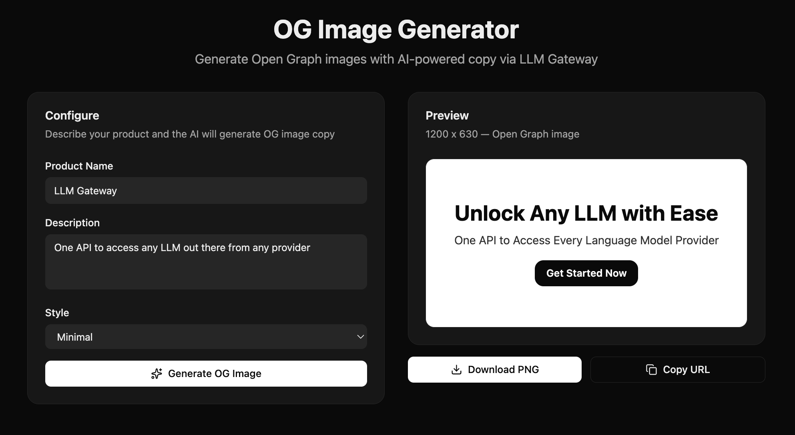

# OG Image Generator Template

A full-stack Next.js app that generates Open Graph images with AI-powered copy via LLM Gateway.



## Features

- AI-generated title, subtitle, and call-to-action copy
- Live OG image preview (1200x630)
- Three visual themes: gradient, minimal, bold
- Download as PNG via `next/og` ImageResponse
- Copy shareable OG image URL
- Built with modern React 19 and Next.js 16

## Tech Stack

- **Framework**: Next.js 16 (App Router)
- **UI**: React 19, Tailwind CSS 4, shadcn/ui
- **AI**: Vercel AI SDK (`generateObject`), LLM Gateway Provider
- **OG Image**: `next/og` ImageResponse (Edge Runtime)
- **Icons**: Lucide React

## Getting Started

### Prerequisites

- Node.js 20+
- pnpm
- [LLM Gateway API Key](https://llmgateway.io)

### Installation

```bash
# From the root of the monorepo
pnpm install

# Or standalone
cd templates/og-image-generator
pnpm install
```

### Environment Setup

```bash
cp .env.example .env.local
```

Edit `.env.local` and add your API key:

```env
LLMGATEWAY_API_KEY=your_api_key_here
```

### Development

```bash
pnpm dev
```

Open [http://localhost:3000](http://localhost:3000) in your browser.

### Production Build

```bash
pnpm build
pnpm start
```

## API Reference

### POST /api/generate

Generate structured OG image copy.

**Request Body:**

```json
{
  "productName": "My Product",
  "description": "A description of the product",
  "style": "gradient"
}
```

**Response:**

```json
{
  "title": "...",
  "subtitle": "...",
  "callToAction": "...",
  "theme": "gradient",
  "gradientFrom": "#6366f1",
  "gradientTo": "#8b5cf6"
}
```

### GET /api/og

Render an OG image as PNG.

**Query Parameters:** `title`, `subtitle`, `cta`, `theme`, `from`, `to`

**Response:** 1200x630 PNG image.

## License

MIT
