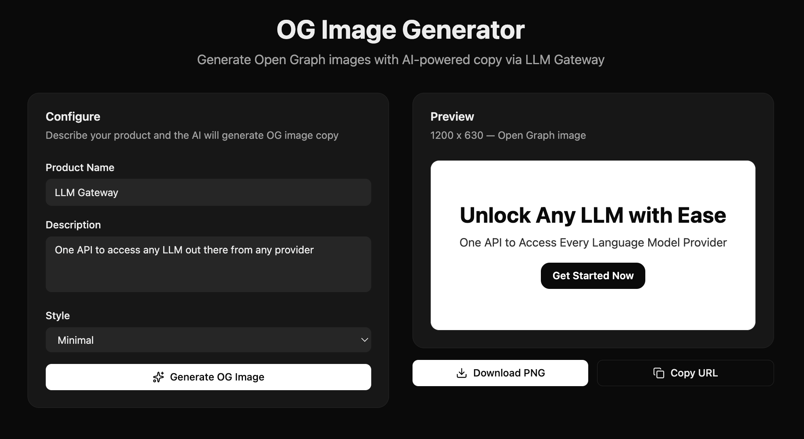

# OG Image Generator Template

A full-stack Next.js app that generates Open Graph images with AI-powered copy via LLM Gateway.



[Live Demo](https://llmgateway-templates-og-image-generator-926.meetploy.app)

[](https://meetploy.com/new/clone?repository-url=https%3A%2F%2Fgithub.com%2Ftheopenco%2Fllmgateway-templates&repository-name=llm-og-image-generator&project-name=llm-og-image-generator&ploy-config=templates%2Fog-image-generator%2Fploy.yaml&env=LLMGATEWAY_API_KEY&envDescription=Enter%20the%20LLM%20Gateway%20API%20key%20required%20by%20this%20template.&envLink=https%3A%2F%2Fdocs.llmgateway.io%2Flearn%2Fapi-keys)

## Features

- AI-generated title, subtitle, and call-to-action copy
- Searchable model picker ([AI Elements model selector](https://elements.ai-sdk.dev/components/model-selector)) filled live from the LLM Gateway catalog
- Live OG image preview (1200x630)
- Three visual themes: gradient, minimal, bold
- Download as PNG via `next/og` ImageResponse
- Copy shareable OG image URL
- Built with modern React 19 and Next.js 16

## Tech Stack

- **Framework**: Next.js 16 (App Router)
- **UI**: React 19, Tailwind CSS 4, shadcn/ui
- **AI**: Vercel AI SDK (`generateObject`), LLM Gateway Provider
- **OG Image**: `next/og` ImageResponse (Edge Runtime)
- **Icons**: Lucide React

## Getting Started

### Prerequisites

- Node.js 20+
- pnpm
- [LLM Gateway API Key](https://llmgateway.io)

### Installation

```bash
# From the root of the monorepo
pnpm install

# Or standalone
cd templates/og-image-generator
pnpm install
```

### Environment Setup

```bash
cp .env.example .env.local
```

Edit `.env.local` and add your API key:

```env
LLMGATEWAY_API_KEY=your_api_key_here
```

### Development

```bash
pnpm dev
```

Open [http://localhost:3000](http://localhost:3000) in your browser.

### Production Build

```bash
pnpm build
pnpm start
```

## API Reference

### POST /api/generate

Generate structured OG image copy.

**Request Body:**

```json
{
  "productName": "My Product",
  "description": "A description of the product",
  "style": "gradient"
}
```

**Response:**

```json
{
  "title": "...",
  "subtitle": "...",
  "callToAction": "...",
  "theme": "gradient",
  "gradientFrom": "#6366f1",
  "gradientTo": "#8b5cf6"
}
```

### GET /api/og

Render an OG image as PNG.

**Query Parameters:** `title`, `subtitle`, `cta`, `theme`, `from`, `to`

**Response:** 1200x630 PNG image.

## Model catalog

The picker is filled at request time from the gateway's public [`/v1/models`](https://api.llmgateway.io/v1/models) catalog (`src/lib/models.ts`, revalidated hourly), so models added to LLM Gateway show up without a code change. Model ids are sent unprefixed (`gemini-3.1-flash-image-preview`) so the gateway [smart-routes](https://docs.llmgateway.io/features/routing) each request to the best available provider — prefix one with a provider id (`google-ai-studio/gemini-3.1-flash-image-preview`) to pin it instead.

## License

MIT
