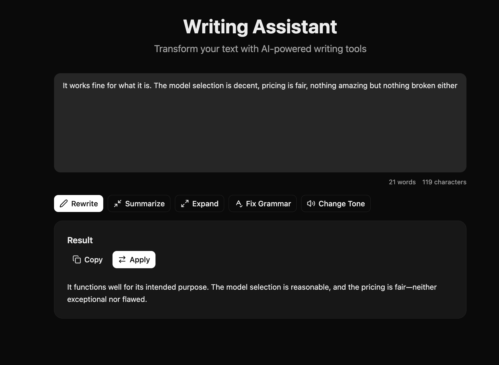

# Writing Assistant Template

A full-stack Next.js app for AI-powered text transformation using LLM Gateway.



[Live Demo](https://llmgateway-templates-writing-assistant-229.meetploy.app)

[](https://meetploy.com/new/clone?repository-url=https%3A%2F%2Fgithub.com%2Ftheopenco%2Fllmgateway-templates&repository-name=llm-writing-assistant&project-name=llm-writing-assistant&ploy-config=templates%2Fwriting-assistant%2Fploy.yaml&env=LLMGATEWAY_API_KEY&envDescription=Enter%20the%20LLM%20Gateway%20API%20key%20required%20by%20this%20template.&envLink=https%3A%2F%2Fdocs.llmgateway.io%2Flearn%2Fapi-keys)

## Features

- Multiple text actions: rewrite, summarize, expand, fix grammar, change tone
- Searchable model picker ([AI Elements model selector](https://elements.ai-sdk.dev/components/model-selector)) filled live from the LLM Gateway catalog
- Tone selector with professional, casual, formal, friendly, persuasive, and academic options
- Apply result to replace original text
- Copy result to clipboard
- Word and character count
- Built with modern React 19 and Next.js 16

## Tech Stack

- **Framework**: Next.js 16 (App Router)
- **UI**: React 19, Tailwind CSS 4, shadcn/ui
- **AI**: Vercel AI SDK (`generateText`), LLM Gateway Provider
- **Icons**: Lucide React

## Getting Started

### Prerequisites

- Node.js 20+
- pnpm
- [LLM Gateway API Key](https://llmgateway.io)

### Installation

```bash
# From the root of the monorepo
pnpm install

# Or standalone
cd templates/writing-assistant
pnpm install
```

### Environment Setup

```bash
cp .env.example .env.local
```

Edit `.env.local` and add your API key:

```env
LLMGATEWAY_API_KEY=your_api_key_here
```

### Development

```bash
pnpm dev
```

Open [http://localhost:3000](http://localhost:3000) in your browser.

### Production Build

```bash
pnpm build
pnpm start
```

## API Reference

### POST /api/assist

Transform text with a specified action.

**Request Body:**

```json
{
  "text": "Your text here",
  "action": "rewrite",
  "tone": "professional"
}
```

**Actions:** `rewrite`, `summarize`, `expand`, `fix-grammar`, `change-tone`

**Response:**

```json
{
  "result": "Transformed text..."
}
```

## Model catalog

The picker is filled at request time from the gateway's public [`/v1/models`](https://api.llmgateway.io/v1/models) catalog (`src/lib/models.ts`, revalidated hourly), so models added to LLM Gateway show up without a code change. Model ids are sent unprefixed (`gpt-5.4-mini`) so the gateway [smart-routes](https://docs.llmgateway.io/features/routing) each request to the best available provider — prefix one with a provider id (`openai/gpt-5.4-mini`) to pin it instead.

## License

MIT
